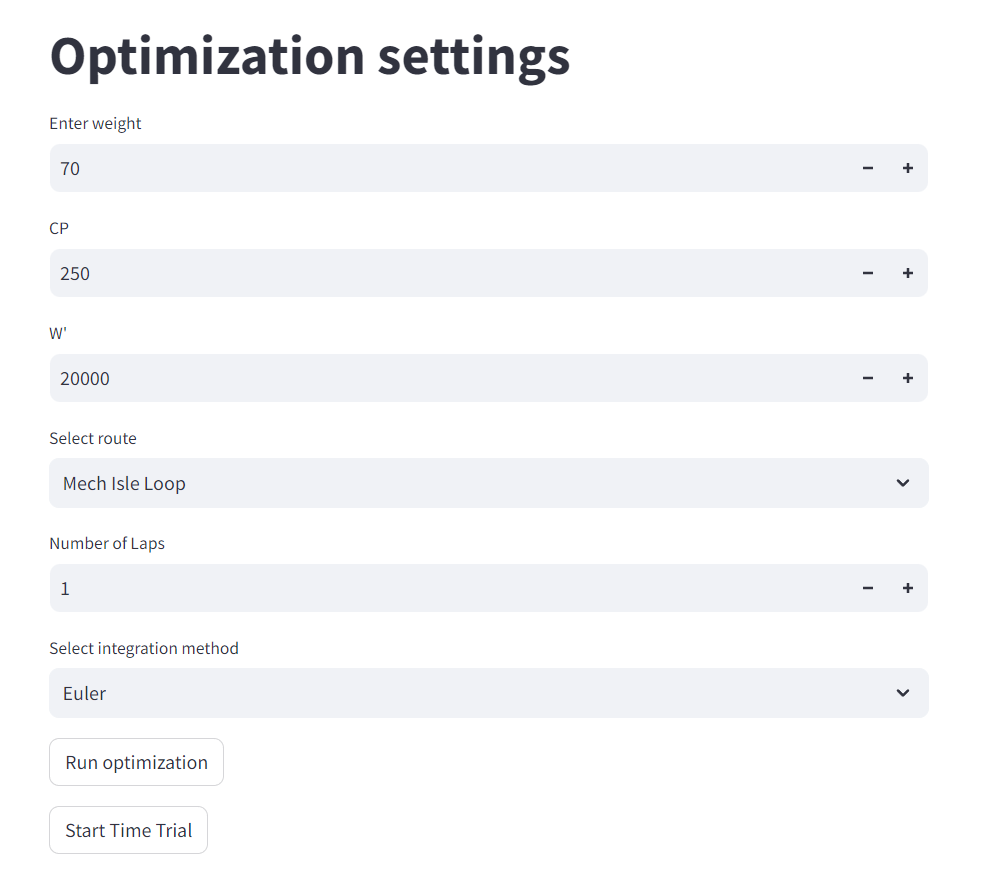

Sauce4zwift Optimal Pacing Mod
========

How to install:
--------
1. You need to have Sauce4Zwift installed on your computer: https://www.sauce.llc/products/sauce4zwift/download  

2. Clone the repository 
```
git clone https://github.com/henrikub/s4z_pacing_mod.git
```

3. Place the folder inside a dedicated "SauceMods" folder within your Documents folder.
```
Documents
└── SauceMods
    ├── s4z_pacing_mod
```
4. Install the required Python packages with the following command:
```
pip install -r requirements.txt
```
How to use:
--------
Run the following command to start the optimization settings interface
```
python -m streamlit run app.py
```
You will then be presented with the following display:  
