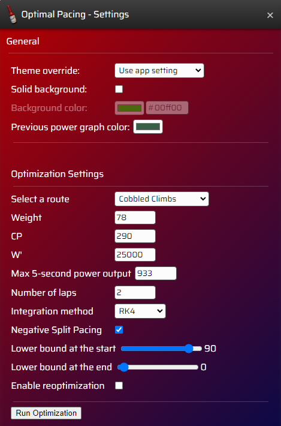
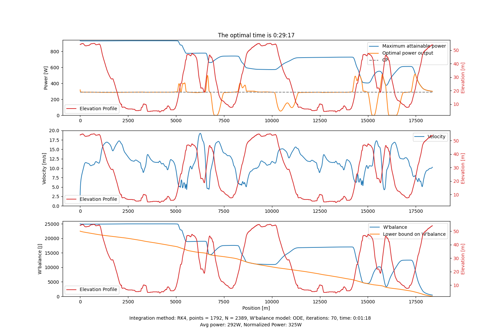
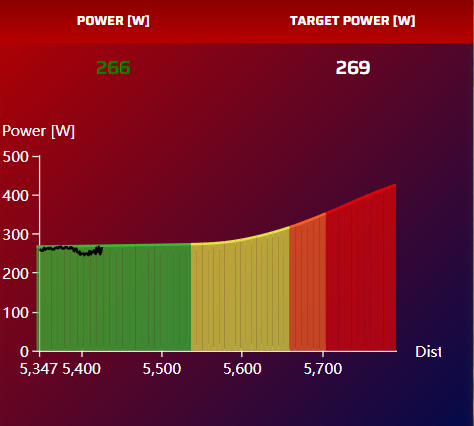

Sauce4zwift Optimal Pacing Mod
========

How to install:
--------
1. You need to have Sauce4Zwift installed on your computer: https://www.sauce.llc/products/sauce4zwift/download  

2. Clone the repository 
```
git clone https://github.com/henrikub/s4z_pacing_mod.git
```

3. Place the folder inside a dedicated "SauceMods" folder within your Documents folder.
```
Documents
└── SauceMods
    ├── s4z_pacing_mod
```
4. Install the required Python packages with the following command:
```
pip install -r requirements.txt
```
You might need to write 'pip3' instead of 'pip' depending on your Python environment.

How to use:
--------
Run the following command to start the server that runs in the background:
```
python server.py
```
You might need to write 'python3' instead of 'python' depending on your Python environment.

You can then specify the optimization settings in the settings part of the mod. If you want to reoptimize the power trajectory throughout the time trial, make sure to check the "Enable reoptimization" box in the settings interface. The reoptimization uses the w'balance value from S4Z, so make sure the values for CP and W' are the same in the optimization settings and in S4Z. 



After specifying optimization settings, press the "Run optimization" button. The plot of the optimization results will be saved in a file 'opt_plot.png' that is located in the mod directory.

  

You can now use the pacing strategy in a time trial. Make sure to press the "Approaching Start Banner" button when you are approximately 5 meters from the start banner. The mod window will display the target power with powerzones based on your FTP, your current power and the optimal W'bal at every point in the route.

  

 

Known issues:
--------
- Except for the "Cobbled Climbs" route, there might be slight inaccuracies regarding the length of the routes, such that the pacing strategy might end a bit before or after crossing the finish line.