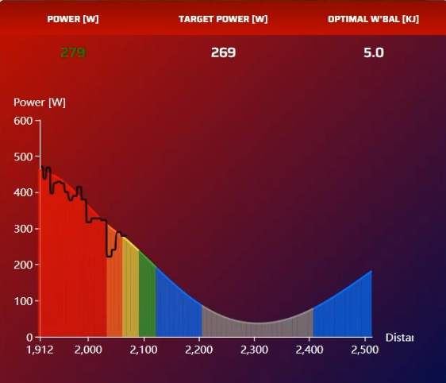

Sauce4zwift Optimal Pacing Mod
========

How to install:
--------
1. You need to have Sauce4Zwift installed on your computer: https://www.sauce.llc/products/sauce4zwift/download  

2. Clone the repository 
```
git clone https://github.com/henrikub/s4z_pacing_mod.git
```

3. Place the folder inside a dedicated "SauceMods" folder within your Documents folder.
```
Documents
└── SauceMods
    ├── s4z_pacing_mod
```
4. Install the required Python packages with the following command:
```
pip install -r requirements.txt
```
You might need to write 'pip3' instead of 'pip' depending on your Python environment.

How to use:
--------
Run the following command to start the optimization settings interface
```
python -m streamlit run app.py
```
You might need to write 'python3' instead of 'python' depending on your Python environment.

You will then be presented with the following display:  


After specifying optimization settings, press the "Run optimization" button. The results will be displayed after the optimization routine is finished.

  

You can now open the "Optimal Pacing" mod in S4Z and your target power will be shown with your powerzones based on your FTP. 

  

If you want to reoptimize the power trajectory throughout the time trial, make sure to press the "Start Time Trial" button before the TT starts. The reoptimization uses the w'balance value from S4Z, so make sure the values for CP and W' are the same in the optimization settings and in S4Z.  

Known issues:
--------
- Sometimes the cyclist's previous power output gets "redrawn" many times in a row instead of incrementing steadily. It usually goes away after a few seconds, but if it gets too annoying closing and reopening the window should fix it.
- There might be inaccuracies regarding the lead-in distance at the beginning of a route. As a consequence, the target power graph being slightly mispositioned along the route. However, if you cross the start banner exactly when the target power graph starts, it should be accurate enough.